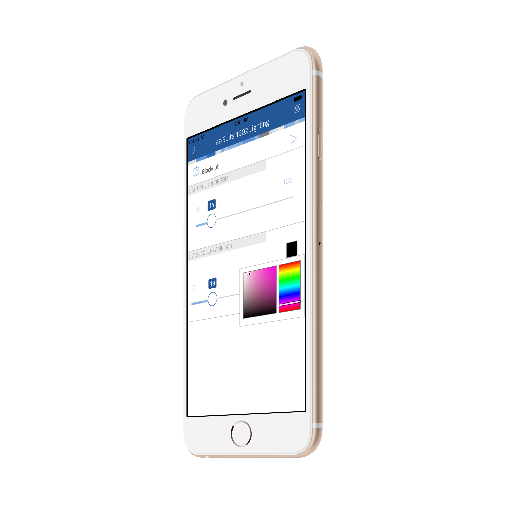

# thing-it-device-philips-hue

[](https://nodei.co/npm/thing-it-device-philips-hue/)
[](https://nodei.co/npm/thing-it-device-philips-hue/)

[thing-it-node] Device Plugin for Philips Hue Bridge to control Philips Hue Light Bulbs and Philips Hue Living Color Lamps.

This allows you to 

* control Philips Hue Bulbs and Lamps over the Internet,
* define complex scenes, storyboards and timer controlled execution 

by means of [thing-it-node](https://github.com/marcgille/thing-it-node) and [thing-it.com](http://www.thing-it.com).

## Installation

### Installation of NodeJS and [thing-it-node]

First, install [nodejs](https://nodejs.org/en/download/) on your computer (e.g. your PC or your Raspberry Pi).

Then install **[thing-it-node]** via

```
npm install -g thing-it-node
```
 
### Initialization and Start of [thing-it-node] 

The **[thing-it-device-philips-hue]** Plugin is installed with **[thing-it-node]**, hence there is no need to install it separately.

The Plugin supports Autodiscovery, hence you only have to create a directory in which you intend to run the configuration, e.g.
 
```
mkdir ~/hue-test
cd ~/hue-test
```

and invoke

```
tin init
```

and then start **[thing-it-node]** via

```
tin run
```

Install the **thing-it Mobile App** from the Apple Appstore or Google Play and set it up to connect to **[thing-it-node]** 
locally as described [here](https://thing-it.com/thing-it/#/documentationPanel/mobileClient/connectionModes) or just connect your browser under 
[http://localhost:3001](http://localhost:3001).
 
### Philips Hue Setup

Connect your Philips Hue Bridge to the same network as the [thing-it-node] Node Box you have configured above 
and install all lighting.

Then push the **Link** Button on the Philips Hue Bridge.

On the **[thing-it] Mobile App** or in the browser, confirm the registration of the Philips Hue Bridge.

**[thing-it-node]** will automatically add all Light Bulbs and Living Color Lamps to your **[thing-it-node]** Configuration and 
you will be able control these from the **[thing-it] Mobile App** immediately.

## Mobile UI

The following screenshot shows the Node Page of the [sample configuration]("./examples.configuration"):

<p align="center"><a href="./documentation/images/mobile-ui.png"></a></p>

## Where to go from here ...

After completing the above, you may be interested in

* Configuring additional [Devices](https://www.thing-it.com/thing-it/#/documentationPanel/mobileClient/deviceConfiguration), 
[Groups](https://www.thing-it.com/thing-it/#/documentationPanel/mobileClient/groupConfiguration), 
[Services](https://www.thing-it.com/thing-it/#/documentationPanel/mobileClient/serviceConfiguration), 
[Event Processing](https://www.thing-it.com/thing-it/#/documentationPanel/mobileClient/eventConfiguration), 
[Storyboards](https://www.thing-it.com/thing-it/#/documentationPanel/mobileClient/storyboardConfiguration) and 
[Jobs](https://www.thing-it.com/thing-it/#/documentationPanel/mobileClient/jobConfiguration) via your **[thing-it] Mobile App**.
* Use [thing-it.com](https://www.thing-it.com) to safely connect your Node Box from everywhere, manage complex configurations, store and analyze historical data 
and offer your configurations to others on the **[thing-it] Mesh Market**.
* Explore other Device Plugins like [Texas Instruments Sensor Tag](https://www.npmjs.com/package/thing-it-device-ti-sensortag), [Plugwise Smart Switches](https://www.npmjs.com/package/thing-it-device-plugwise) and many more. For a full set of 
Device Plugins search for **thing-it-device** on [npm](https://www.npmjs.com/). Or [write your own Plugins](https://github.com/marcgille/thing-it-node/wiki/Plugin-Development-Concepts).